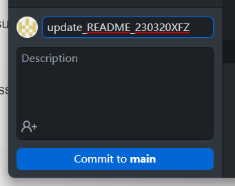

# Vcat_AI_virtual_pet
comp3070_Reality——Game interface: An intellgent  generating and interactable vitural pet 

# 编辑要求：上传任何文件，须将单次上传内容的最上层文件夹命名为：*_yymmddname.*

EX: code_220316xfz.ipynb

文件目录框架除外

同工作内容文件对应目录下只保留最新版本，历史版本统一放入对应文件夹history目录下

文件较多更新频率较快时，可以采用写summary/description的方式节省时间，例如：

.md文件的图像存储目录在相对路径的assets文件夹内

# 更新日志

更新日志格式：yymmdd_xxx：content

230318_xfz：上传SRS并更新了1.*简介及2.1性能需求。

230319_xfz：创建history，更新SRS及云服务器配置笔记

230322_hjc: 上传Alpaca语言模型

230323_hjc: 

1. 创建深度学习环境配置：Pytorch，CUDA开发环境cudnn Gpu 加速配置
2. 创建语言模型部分：首先使用chatGML作为第一语言模型，加载数据集，生成完整模型。
# 开发日志

强调：安装并使用typora

注意：新建多个文件夹及文件上传时需onebyone
