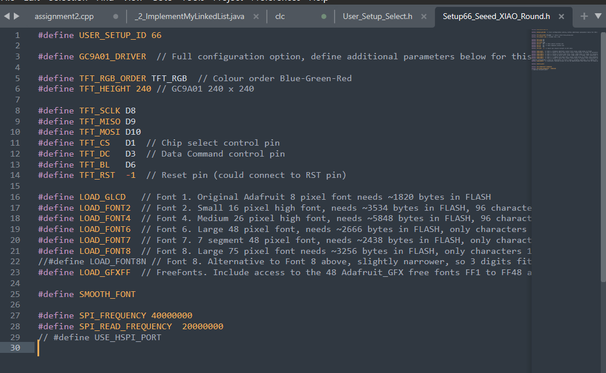
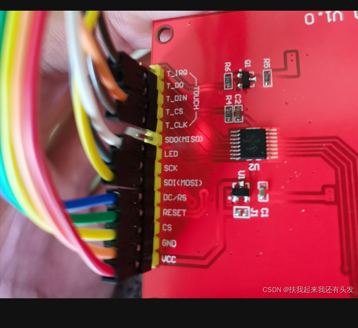
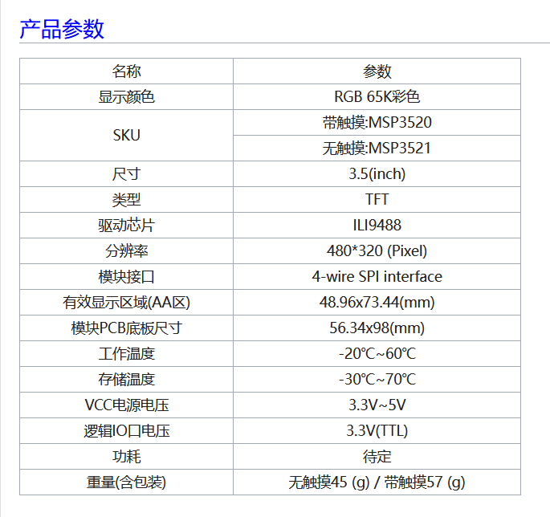
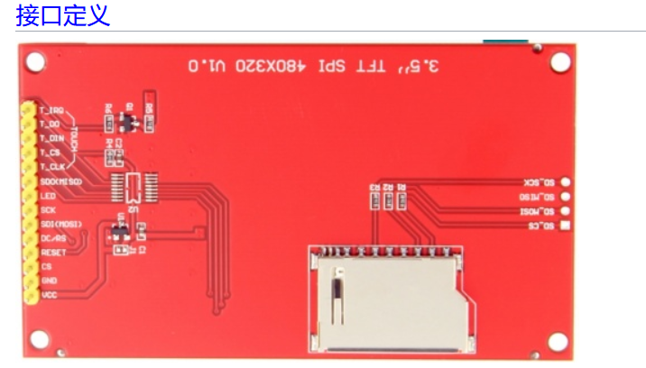
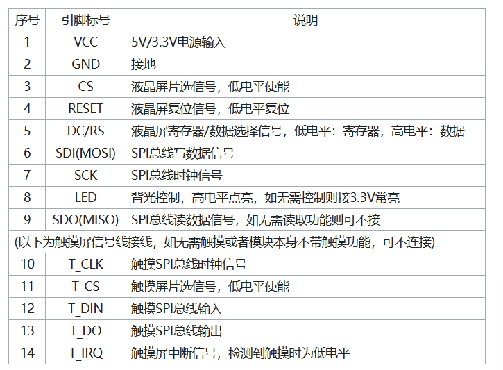

TFT笔记

https://wiki.seeedstudio.com/get_start_round_display/

D:\Disk_C\Documents\Arduino\libraries\TFT_eSPI-master

D:\Disk_C\Documents\Arduino\libraries\TFT_eSPI-master\User_Setups

BL 背光接led

MOSI接错脚了