# COMP3070大项目

## 更新日志：

云服务器登录 2.23 xfz

工作内容板块 3.03  xfz

前端开发内容——开发框架、方式等汇总 4.25 xfz 

# -1.工作内容：

### 截至3.6前应完成的任务：

#### （1）软件安装：

​		安装包见qq群文件

1. typora， 用于支持md文件，支持markdown语法，便于撰写开发文档
2. jupyterlab，记得先安装anaconda。jupyterlab是一款内置浏览器的pythonIDE，同时支持markdown语法。

#### （2）测试能否连接云服务器

​			方法参见==2.软件-后端-服务器与网络==

​			workbench先登录自己阿里云账户（可通过任意阿里旗下账号），再登陆linux用户comp3070。若不能直接通过workbench连接则下载xshell进行连接（参考云服务器配置笔记.md）。

### 3.21 剩余工作

(1) UML——zth

(2) 页面设计——Axura


(3) MySQL数据库——登录信息——采集的信息（图像、语言）的存储——zth

​	——python

(4) 微信小程序、vue和react开发——ybs

(5) CV 和 NLP算法——hjc

(6) chatGLM

(7) 图像生成与融合——能接入网页的简单游戏页面——unity


# 0.乱七八糟吹牛逼用

Reality——Game interface: An intellgent  generating and interactable vitural pet 

+ 基于游戏用户互动的数据挖掘系统

+ 基于图像融合的游戏生物自动生成模型

+ 自动环境绘图

+ 生成自然的npc对话

+ 词性评价（非须）

+ 元宇宙——计算机视觉自动建模——数字孪生

  启发：

  元宇宙与现实世界互动的成本高，数字孪生成本高

  游戏内容发展局限于预设内容，自由度有限——新型精灵游戏与图像融合技术

  宠物饲养困难
  
  贾维斯——AI助手

# 1.硬件

### (1) 元件、打板

#### 核心

#### 传感

#### 显示

arduino触摸屏 or 全息

#### 接口

### (2) 焊接

# 2.软件

## (1) Arduino烧录

## (2) 算法

#### CV

#### NLP

#### 强化学习

#### 数据处理算法

## (3) 前端

### 1）开发方法

#### (a) 概览

使用“React技术栈”，即React JS库及其相关框架

本项目采用==React+TypeScript+umi+dva+antd-mobile==的框架开发方式进行搭建。

#### (b) 理由

1.  React：指用于构建用户界面的JavaScript库，具有组件化、声明式等特点，具有优秀的DOM性能优化。

2. React技术栈：其整个技术栈是一个渐进式的框架——主张最少，可以只用其中一部分。例如，开始时只需React， 有新需求后可以引入其他类库如路由库、状态管理库等。

3. TypeScript：TypeScript是JavaScript的超集，最终会被编译为JS代码。它添加了可选的静态类型系统与很多尚未正式发布的ECMAScript新特性，如装饰器。

4. umi：React开发框架。理解为一个专注性能的类next.js前端框架，通过约定、自动生成和解析代码等方式辅助开发。

   - 内置大量性能优化
   - 多端，无缝支持容器和浏览器访问，
   - 类webpack的插件机制
   - 对antd和dva有友好支持

   “文件即路由”——page文件夹下新建文件，umi自动生成与文件路径对应的路由。

   ​	解决如下问题：

   - ​	项目既可以跑在如支付宝/淘宝/微信容器里（多页），又可以跑在普通浏览器里（单页）。
   - 开发调试的启动和热更新时间随项目变大越来越长。
   - 基于路由做按需加载。
   - 支持PWA
   - preact
   - 部署问题

   [umi参考文档](https://www.cnblogs.com/AllenPan/p/16440013.html)

#### （c) 服务器项目打包方式

zip....但很慢

### 2）umi + nginx部署前端网站

打开Nginx的配置文件（通常在/etc/nginx/nginx.conf），在http块内添加以下内容：

```bash
server {
    listen 81;   # 注意端口号设置
    server_name 120.25.2.21;   # 注意替换为的服务器公网IP
    location / {
        proxy_pass http://localhost:8000;   # 注意替换为Dumi项目的端口号
        proxy_http_version 1.1;
        proxy_set_header Upgrade $http_upgrade;
        proxy_set_header Connection 'upgrade';
        proxy_set_header Host $host;
        proxy_cache_bypass $http_upgrade;
    }
}


```

为Nginx监听了81端口，并将请求代理到本地的8000端口上，这是umi项目启动时默认的端口号。如果你的Dumi项目使用了其他端口号，需要相应地修改。

此时在对应umi项目文件夹下进行npm start即可访问网站。

npm start报错

```
  opensslErrorStack: [ 'error:03000086:digital envelope routines::initialization error' ],
  library: 'digital envelope routines',
  reason: 'unsupported',
  code: 'ERR_OSSL_EVP_UNSUPPORTED'
```

原因：nodejs版本过高

解决：

```bash
export NODE_OPTIONS=--openssl-legacy-provider 
```

  pnpm 创建项目

```bash
pnpm dlx create-umi@latest
```

 https://umijs.org/docs/tutorials/getting-started

### 3) 底层模板页与登录页面

#### (a) 模板页面：

1. 带顶部导航条的基础模板（BasicLayout）
2. 权限模板（SecurityLayout）
3. 后续具体增加

#### (b) 基础模板

基础模板作为所有页面的底层模板，会==首先请求用户基本信息==，判断是否登录，如果是进入需要登录的页面并且未登录，则跳转登录页，否则留在当前页面。基础模板需要判断是否需要显示导航条。同时，每个页面刷新都需要判断是否登录，获取用户基础信息也都放在基础模板页，同时记录到user state中。

```react
import {ConnectState,ConnectProps, UserModelState} from '@/models/connect';
interface BasicLayoutProps extends ConnectProps{
    user: UserModelState;
}
```

检测客户端设备对应IP登录状态

（React—>Django(axios->JWT->user)

##### 基本开发

CSS+JS+HTML

[vitejs](https://cn.vitejs.dev/guide/)

[react](https://react.docschina.org/)


##### 响应式网页

ASouthernCat

#### 图像展示

##### 动画制作

blender+verge3D

gooblend

##### AI 动画

Stable diffusion

##### 数据监测展示

Flask 、Dashboard

#### 基本网页框架

##### 基本开发

CSS+JS+HTML

react

[vitejs](https://cn.vitejs.dev/guide/)

[react](https://react.docschina.org/)

##### 响应式网页

ASouthernCat

#### API

##### 微信小程序接口


### 4) webpack代码打包工具部署

新建目录，在新建目录下执行

```bash
npm init -y
```

初始化项目(生成package.json)


安装webpack-cli(使用webpack的命令行工具）：

```bash
npm install webpack webpack-cli -D
```


运行webpack：

```bash
npx webpack
```

 (要先有src目录和index.html才能成功)


使webpack全局环境下可用：

```bash
npm install webpack -global
```

但全局可能会导致一些版本问题（如项目中webpack被锁定到指定版本）

最新版：

```bash
npm install webpack@beta
```

#### （a) 初始化项目结构

项目结构：

```c
webpack-demo
    |-node_modules
    |-package.json
    |-package-lock.json
   +|-index.html
   +|-/src
   +	|-index.js
   +	|-show.js
```

#### (b) 代码开发

根据个人体验，推荐先使用在线IDE [StackBlitz](https://stackblitz.com/)进行实时渲染开发，然后将代码移植到服务器项目目录中。

git下对应工作目录：[vcat前端](..\软件开发\前端\vcat)


index.js文件被打包到了dist文件夹下，默认使用production mode（生产环境）。打开dist/main.js可以看到被压缩的代码，说明是生产环境打包。

执行构建后的项目结构：

```bash
webpack-demo
   +|-dist
   +	|-main.js
    |-node_modules
    |-package.json
    |-package-lock.json
    |-index.html
    |-/src
    	|-index.js
    	|-show.js
```

总的来说，执行npx webpack会将脚本src/index.js作为入口起点，也会生成dist/main.js作为输出。目录下多出dist目录，里面的main.js文件是一个可执行的JS文件，包含webpackBootstrap启动函数。

然后将index.html的js文件引用替换为dist/main.js

### 5)nginx配置

查看 Nginx 配置文件的位置：

```bash
nginx -t
```

清理端口：

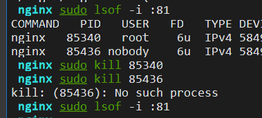

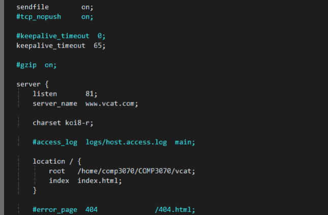

### 6）TDesign

https://tdesign.tencent.com/starter/docs/react/get-started

使用腾讯的框架实现快速页面部署

```

```

### 7）AntDesign

最后选择AntDesign进行前端开发

https://landing.ant.design/docs/use/dumi

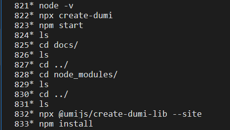

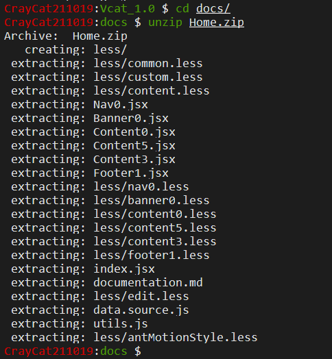

### 8）axios接口封装


## (4) 后端

### 1）框架

使用Django框架，系统采用前后端分离设计，后端Django采用Django RestFramework，为前端界面提供数据及其他资源。页面端为微信小程序的开发提供API预置接口。

#### (a) Django Rest framework —— JWT实现登录

JWT （Json Web Token) 主要用于用户登录鉴权，一种认证机制，让后台知道该请求是来自于受信的客户端。


1. 用户使用账号、密码登录应用，登录的请求发送到 Authentication Server。
2. Authentication Server 进行用户验证，然后创建 JWT 字符串返回给客户端。
3. 客户端请求接口时，在请求头带上 JWT。
4. Application Server 验证 JWT 合法性，如果合法则继续调用应用接口返回结果。

```reStructuredText
xxxxx.yyyyy.zzzzz
```


##### Header

JWT 第一部分是头部分，它是一个描述 JWT 元数据的 Json 对象，通常如下所示。

```json
{
    "alg": "HS256",
    "typ": "JWT"
}
```

alg 属性表示签名使用的算法，默认为 HMAC SHA256（写为HS256），typ 属性表示令牌的类型，JWT 令牌统一写为JWT。

最后，使用 Base64 URL 算法将上述 JSON 对象转换为字符串保存。

##### Payload

JWT 第二部分是 Payload，也是一个 Json 对象，除了包含需要传递的数据，还有七个默认的字段供选择。

- iss (issuer)：签发人/发行人
- sub (subject)：主题
- aud (audience)：用户
- exp (expiration time)：过期时间
- nbf (Not Before)：生效时间，在此之前是无效的
- iat (Issued At)：签发时间
- jti (JWT ID)：用于标识该 JWT

```json
{
    //默认字段
    "sub":"主题123",
    //自定义字段
    "name":"java技术爱好者",
    "isAdmin":"true",
    "loginTime":"2021-12-05 12:00:03"
}
```

需要注意的是，默认情况下 JWT 是未加密的，任何人都可以解读其内容，因此一些敏感信息不要存放于此，以防信息泄露。

JSON 对象也使用 Base64 URL 算法转换为字符串后保存，是可以反向反编码回原样的，这也是为什么不要在 JWT 中放敏感数据的原因。


##### Signature

```text
header (base64URL 加密后的)

payload (base64URL 加密后的)

secret
```

JWT 第三部分是签名。是这样生成的，首先需要指定一个 secret，该 secret  仅仅保存在服务器中，保证不能让其他用户知道。这个部分需要 base64URL 加密后的 header 和 base64URL 加密后的  payload 使用 . 连接组成的字符串，然后通过header 中声明的加密算法 进行加盐secret组合加密，然后就得出一个签名哈希，也就是Signature，且无法反向解密。

那么 Application Server 如何进行验证呢？可以利用 JWT 前两段，用同一套哈希算法和同一个 secret 计算一个签名值，然后把计算出来的签名值和收到的 JWT 第三段比较，如果相同则认证通过。

```react
loginHandler(){
	this.$axios.post(`${this.$settings.HOST}/user/login/`, {
	  username: this.username,
	  password: this.password
	}).then(response=>{
	  if(this.remember){
	    //记住登录状态
	    sessionStorage.removeItem("user_token")
	    localStorage.user_token = response.token
	  }else{
	    //不记住登录状态
	    localStorage.removeItem("user_token")
	    sessionStorage.user_token = response.token
	  }
	}).catch(error=>{
	  this.$message.error("登录失败")
	  console.log(error.response)
	})
}

```

[JWT参考文档1(定义、与Django的user)](https://blog.csdn.net/weixin_45410366/article/details/125031959)

#### (b) axios 实现前后端通信

##### pre: ajax

**AJAX（ Asynchronous JavaScript and XML）**指异步和JavaScript和XML结合的一种技术。ajax可以实现网页的异步更新，意味着可以不重新加载整个页面的情况下，对网页的某个部分进行更新。组成：

1. 异步的js事件
2. 其他的js（用来处理解析数数据）
3. XMLHttpRequest对象
4. 数据（txt、json、xml、html）

请求原理

1. 创建XMLHttpRequest实例对象；
2. 设置回调函数；
3. 通过XMLHttpRequest.open发出Http网络请求,和服务器端进行连接；
4. 服务器端收到请求，发出请求的数据；
5. 检查网络请求对象的状态，如果响应成功，浏览器接收返回的数据，并且更新页面。

##### Axios

axios是通过Promise对ajax的封装，是一个基于Promise 的Http库，可以在浏览器和Node.js中使用。

简单理解为：axios是一个封装好的，基于Promise的发送请求的方法，不用设置回调，直接调用then方法。

1. 在浏览器中创建XMLHttpRequest对象；
2. 在node.js中创建Http请求
3. 支持拦截请求和响应
4. 自动转换将响应为JSON格式
5. 提供一些并发请求

##### Why axios

1. axios是通过Promise实现ajax技术的一种封装，就像jquery对ajax的封装一样；
2. axios返回的数据是一个promise，ajax返回的数据是回调；
3. axios比ajax更加好用，更加安全；

[axios参考文档（定义、基本使用）](https://blog.csdn.net/Senora/article/details/122220983)

[axios实现登录操作react与Django前后端交互](https://backend.devrank.cn/traffic-information/7081681144735107109)


### 2)协议


#### 数据库

mysql + json + ....

#### 服务器与网络

##### 服务器

服务器：阿里云[ecs-workbench](https://ecs-workbench.aliyun.com/?from=EcsConsole&instanceType=ecs&regionId=cn-shenzhen&instanceId=i-wz9d1gubaizfxmkfak9t&resourceGroupId=&language=zh)

先登录个人阿里云用户再用Linux用户登录服务器：

如果workbench无法登录则下载xshell登录


域名：

apache2 + .....

###### zsh

实例名：


CrayCatXFZ211019

i-wz9d1gubaizfxmkfak9t

#### 核心开发语言

C/py/java

#### 

### 3) Django

4.1.2

#### (1)virtualenv

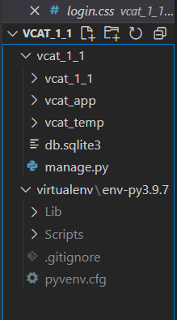

[参考书目《Django+Vue.js实战派》]()

#### (2)路由

urls.py中urlpatterns从上到下进行匹配，不成功返回404

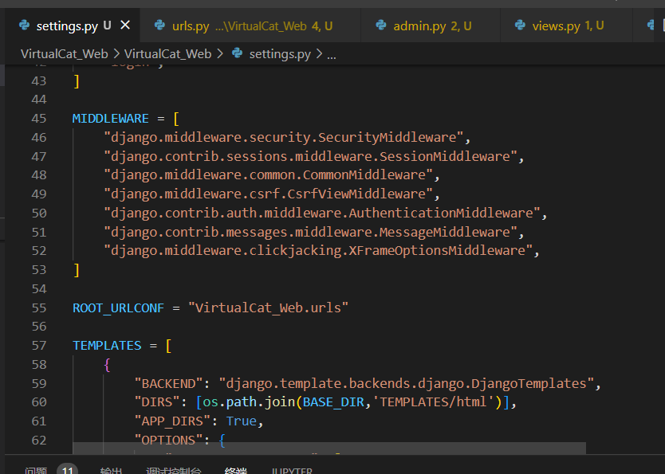


#### (3) 配置中间件行为CORS

后端Django服务器在运行，并且仍然没有接收到数据，可能有以下几个原因：

1. 跨域请求：在开发过程中，如果前端应用运行在不同的域名或端口下，可能会遇到跨域请求的问题。在这种情况下，你需要在Django后端配置跨域访问的允许规则，以便接收来自前端应用的请求。你可以使用Django的CORS插件来处理跨域请求。
2. CSRF保护：Django默认启用了CSRF保护，要求在进行POST请求时，需要包含CSRF令牌。如果你的前端应用发送POST请求时没有正确地包含CSRF令牌，Django会拒绝请求。你可以在前端代码中添加CSRF令牌来解决此问题。你可以通过Django的`csrftoken`cookie来获取CSRF令牌，并将其包含在POST请求的头部中。

https://github-com.translate.goog/adamchainz/django-cors-headers?_x_tr_sl=auto&_x_tr_tl=zh-CN&_x_tr_hl=zh-CN

pip install django-cors-headers

```python
INSTALLED_APPS = [
    "django.contrib.admin",
    "django.contrib.auth",# 权限管理模块
    "django.contrib.contenttypes",# 内容管理模块
    "django.contrib.sessions",
    "django.contrib.messages",
    "django.contrib.staticfiles",
    "corsheaders", #跨域
    'rest_framework',
    'rest_framework_simplejwt',
    'login',
    'pets',
    
]

MIDDLEWARE = [
    "django.middleware.security.SecurityMiddleware",
    "django.contrib.sessions.middleware.SessionMiddleware",
    "django.middleware.common.CommonMiddleware",
    "corsheaders.middleware.CorsMiddleware",
    #前后端分离
    #"django.middleware.csrf.CsrfViewMiddleware",
    "django.contrib.auth.middleware.AuthenticationMiddleware",
    "django.contrib.messages.middleware.MessageMiddleware",
    "django.middleware.clickjacking.XFrameOptionsMiddleware",
]

#CORS
#凡是出现在白名单中的域名，都可以访问后端接口
CORS_ORIGIN_WHITELIST = (
    'http://localhost:8001',
    'http://127.0.0.1:8001',
    'http://192.168.1.101:8001',
)

#运行所有用户访问,和上面的二选一
#CORS_ORIGIN_ALLOW_ALL = True

#指明在跨域访问中，后端是否支持对cookie的操作
CORS_ALLOW_CREDENTIALS = True;
```


#### (4)migrations 迁移文件 —— 数据库和模型对应

生成迁移文件：根据模型类生成创建表的迁移文件

```
python manage.py makemigrations
```

执行迁移：根据生成的迁移文件在数据库中建表

```python
python manage.py migrate
```


#### (5)后台系统admin


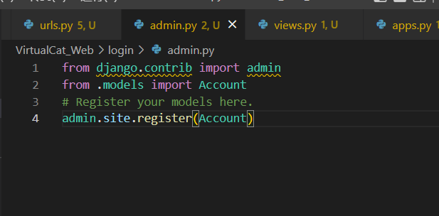


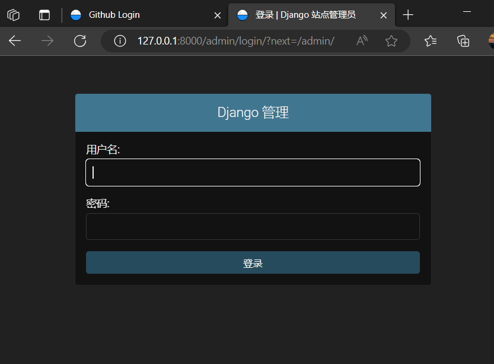

```
python manage.py createsuperuser
```

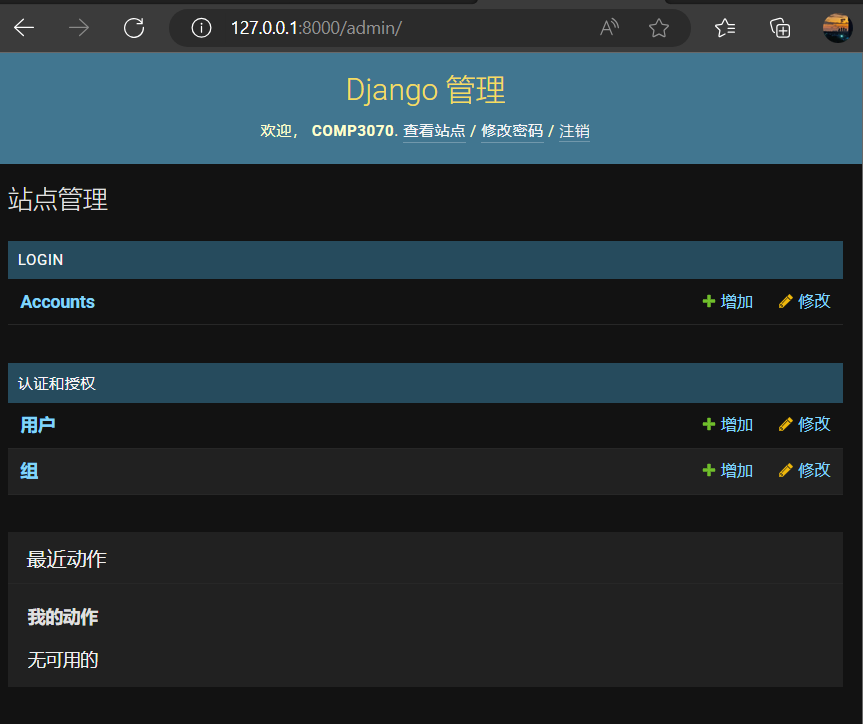

修改语言及时区

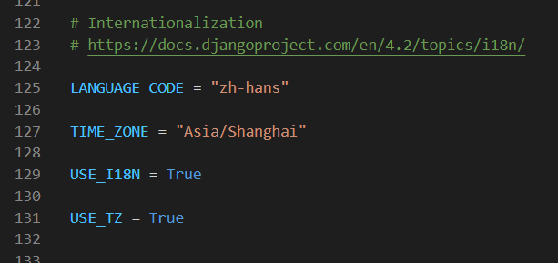

可以直接对数据进行增删改查

##### 自定义管理页面

继承admin.ModelAdmin

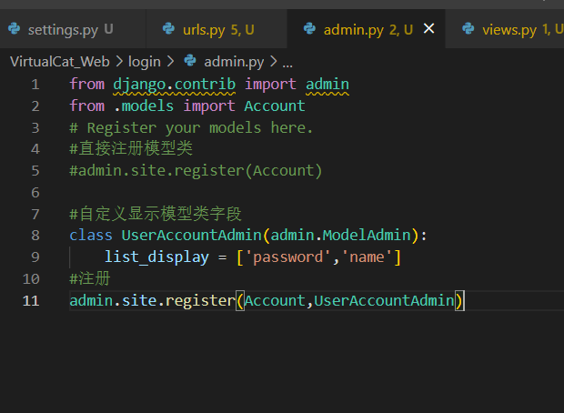

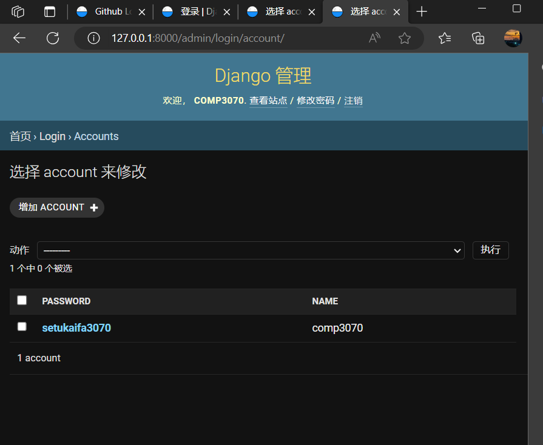

#### (6)视图函数

视图函数必须定义一个参数（通过命名为request）

request参数: 用来接受客户端的请求信息

视图函数返回值必须是一个HttpResponse的对象或子类

可以通过django.shortcuts调用

- `django.shortcuts`提供了更高级的函数，可以简化常见的开发任务。例如，`render`函数可以渲染模板并返回一个`HttpResponse`对象，而不需要显式创建`HttpResponse`对象。
- `django.http`提供了更底层的HTTP相关的类和函数，允许你更精细地控制HTTP请求和响应的各个方面。`HttpResponse`类允许你手动设置HTTP状态码、响应头和响应内容等。

使用`django.shortcuts`模块中的函数可以帮助你更快地完成常见任务，而使用`django.http`模块中的类和函数可以提供更大的灵活性和控制力。


MVT思想中view更像MVC的controller

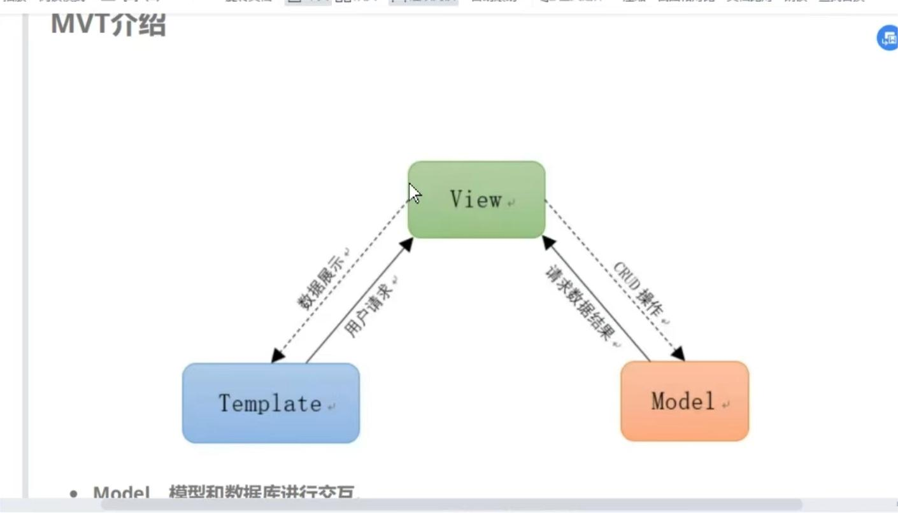

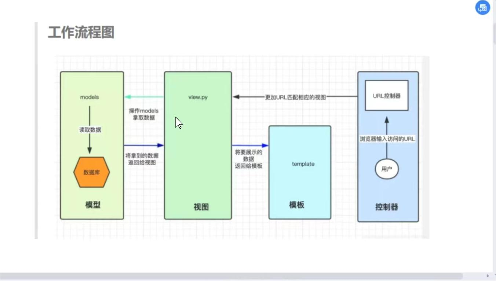


##### 配置URL

方便管理，在应用目录下复制项目的url文件

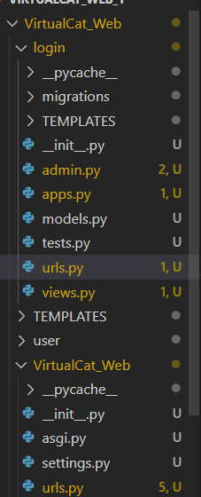

配置路由规则


访问路径login -> 调用视图函数login

如果访问路径是login开头的则进入login.urls文件进行匹配

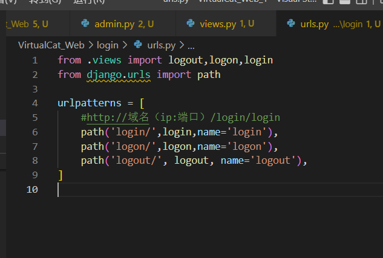

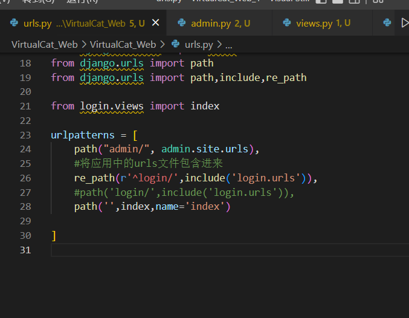

视图使用流程：

​	在应用的views定义视图函数

​	配置路由

​		在项目目录的urls.py中关联应用下的urls.py

​		在应用的目录下定义一个urls.py文件（可以直接复制项目目录下的）

​		配置具体的访问规则


#### (7)ORM

Object Relation Mapping

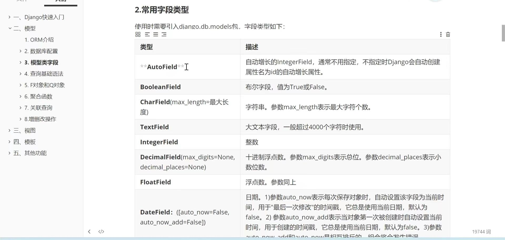

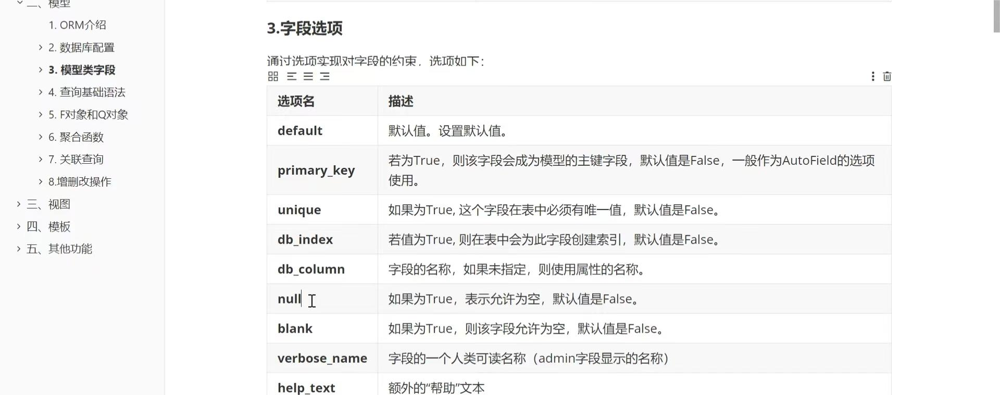

host可以填云数据库的公网ip

 pip install mysqlclient


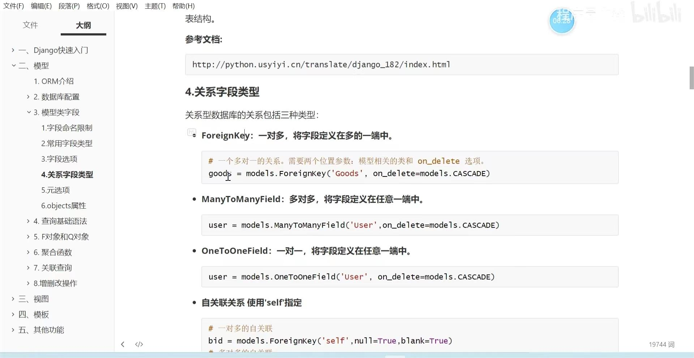

创建model和表的映射

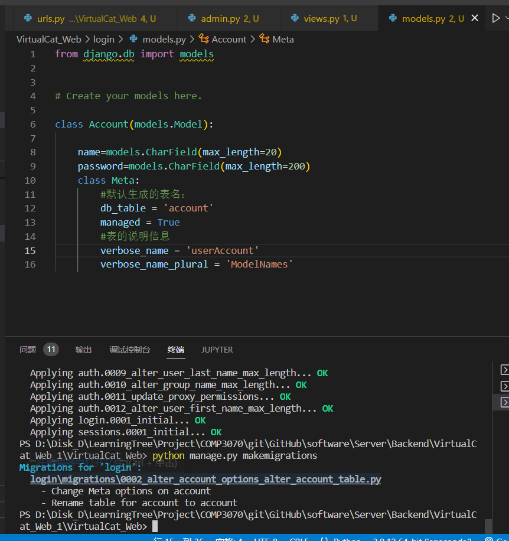

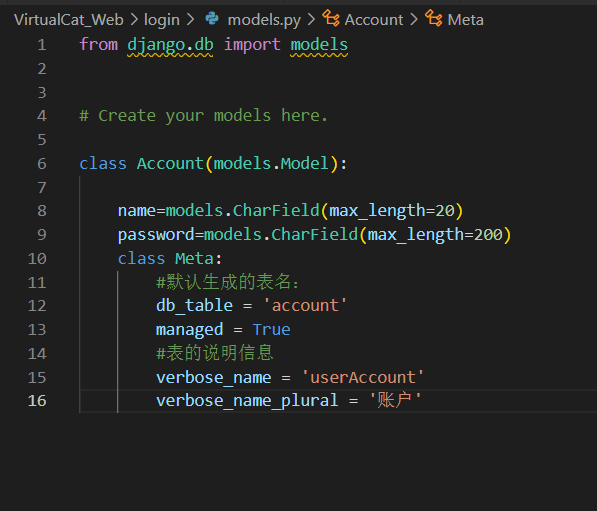


从后台进行管理

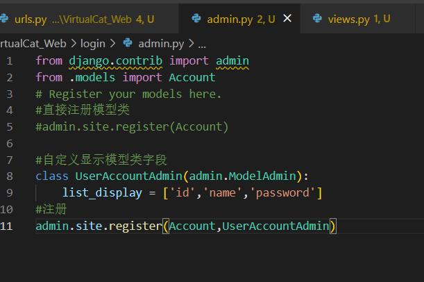

##### 模型类的查询方法

​	get方法：查询一条数据

​			NewsType.object.get(id=3)

​	没找到数据会直接报错（DoesNotExist)

filter根据条件过滤查询

​	返回查询集querySet对象

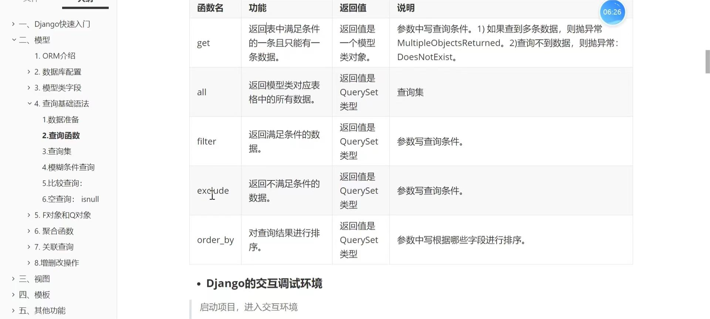

惰性查询，支持索引和切片


#### 8)接口实现（Postman测试）

##### 登录接口

###### 定义视图

###### 配置url

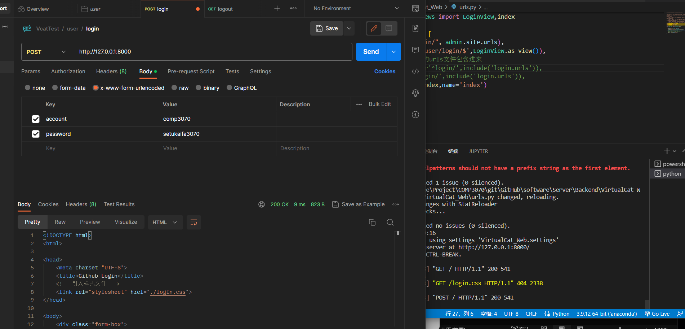

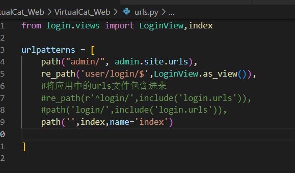

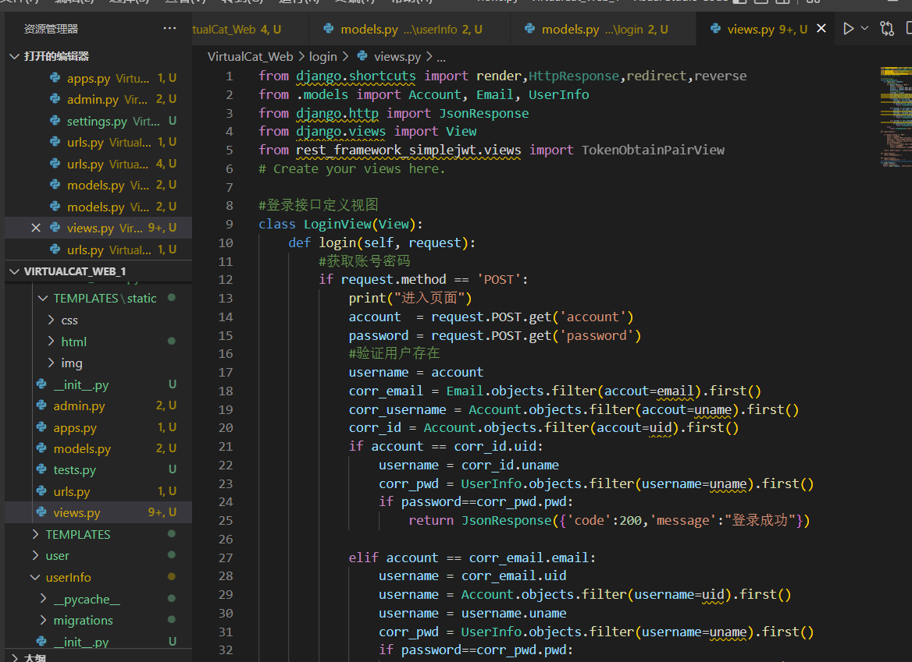

JSON传递参数

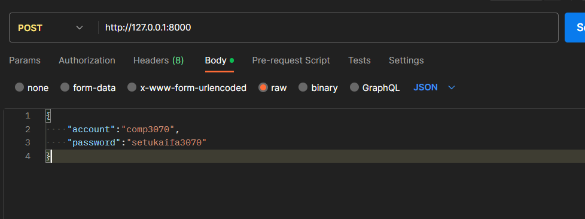

request.POST:获取表单参数

request.body:获取JSON参数

```python
import json
param = request.POST if len(request.POST) else json.loads(request.body.decode())

```

```python
class LoginView(View):
    def login(self, request):
        #获取账号密码
        params = request.POST if len(request.POST) else json.loads(request.body.decode())
        
        print("进入页面")
        account  = params.get('account')
        password = params.POST.get('password')
        #验证用户存在
        username = account
        corr_email = Email.objects.filter(accout=email).first()
        corr_username = Account.objects.filter(accout=uname).first()
        corr_id = Account.objects.filter(accout=uid).first()
        if account == corr_id.uid:
            username = corr_id.uname
            corr_pwd = UserInfo.objects.filter(username=uname).first()
            if password==corr_pwd.pwd:
                return JsonResponse({'code':200,'message':"登录成功"})

        elif account == corr_email.email:
            username = corr_email.uid
            username = Account.objects.filter(username=uid).first()
            username = username.uname
            corr_pwd = UserInfo.objects.filter(username=uname).first()
            if password==corr_pwd.pwd:
                return JsonResponse({'code':200,'message':"登录成功"})

        elif account == corr_username.uname:
            corr_pwd = UserInfo.objects.filter(username=uname).first()
            if password==corr_pwd.pwd:
                return JsonResponse({'code':200,'message':"登录成功"})
        else:
            return JsonResponse({'code':400,'message':"登录失败"},status=400)#登录接口定义视图
class LoginView(View):
    def post(self, request):
        # 处理POST请求
        params = request.POST if len(request.POST) else json.loads(request.body.decode())
        account = params.get('account')
        password = params.get('password')

        if account.isnumeric():
            # 账号是一个数字，按uid匹配
            corr_id = Account.objects.filter(uid=int(account)).first()
            if corr_id:
                # 找到匹配的账号
                # 进一步处理密码验证逻辑
                if password == corr_id.password:
                    return JsonResponse({'code': 200, 'message': "登录成功"})
                else:
                    return JsonResponse({'code': 400, 'message': "密码错误"})
            else:
                return JsonResponse({'code': 400, 'message': "账号不存在"})
        else:
            # 账号不是一个数字，按email或uname匹配
            corr_email = Email.objects.filter(email=account).first()
            corr_username = Account.objects.filter(uname=account).first()

            if corr_email:
                # 账号匹配到了email字段
                username = corr_email.uid
                username = Account.objects.filter(uid=username).first()
                username = username.uname
                corr_pwd = UserInfo.objects.filter(uname=username).first()
                if password == corr_pwd.pwd:
                    return JsonResponse({'code': 200, 'message': "登录成功"})
            elif corr_username:
                # 账号匹配到了uname字段
                corr_pwd = UserInfo.objects.filter(uname=account).first()
                if password == corr_pwd.pwd:
                    return JsonResponse({'code': 200, 'message': "登录成功"})

            return JsonResponse({'code': 400, 'message': "登录失败"}, status=400)
```

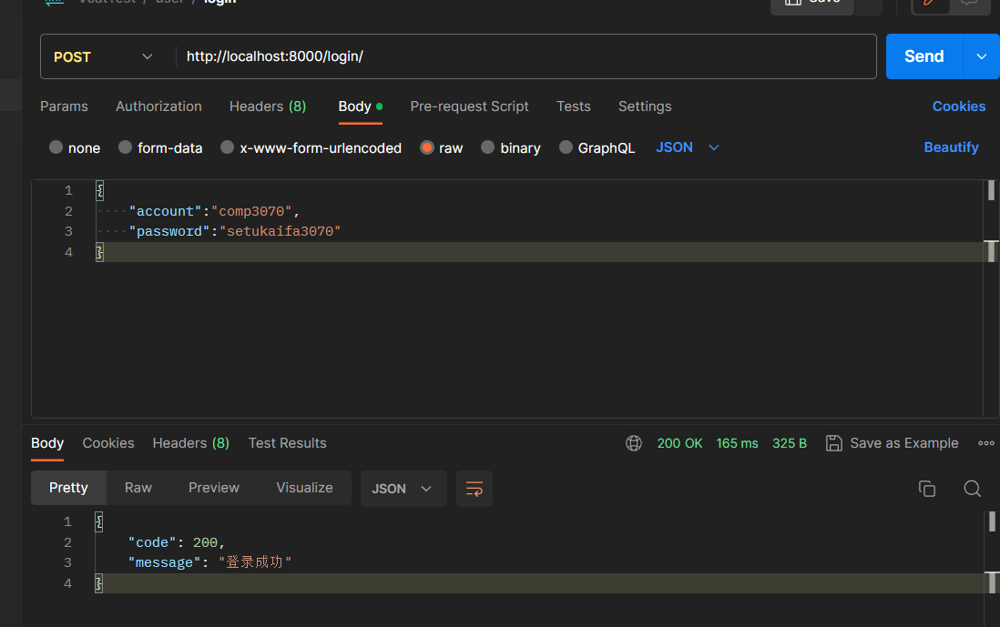

##### 接口权限管理

使用Django的会话（session）机制来跟踪用户的认证状态。会话是一种存储在服务器上的数据，用于在用户请求之间存储和共享信息。在Django中，您可以通过使用`request.session`对象来访问和操作会话数据。

```python
 request.session['user_id'] = corr_username.uid
```

```python
class PetView(View):
    #宠物仓接口
    def get(self,request):
        #权限管理
        if 'user_id' not in request.session:
            # 用户未登录，返回未授权的错误信息
            return JsonResponse({'code': 401, 'message': "未授权"}, status=401)
        '''获取宠物列表'''
        petsInfo = PetsInfo.objects.all()
        petcabin = []
        for p in petsInfo:
            dict = {"id":p.pet_id,"name":p.pet_name,"level":p.level}
            petcabin.append(dict)
        return JsonResponse({'code': 1000, 'message': "获取成功","petcabin":petcabin})

    def post(self,request):
        '''添加及其他操作'''
    def delete(self,request):
        '''删除宠物'''
```

另外可以定义一个装饰器函数，用于检查用户是否已登录。如果用户已登录，则继续执行视图函数；否则，返回相应的错误响应。

postman测试时要利用cookie新建环境

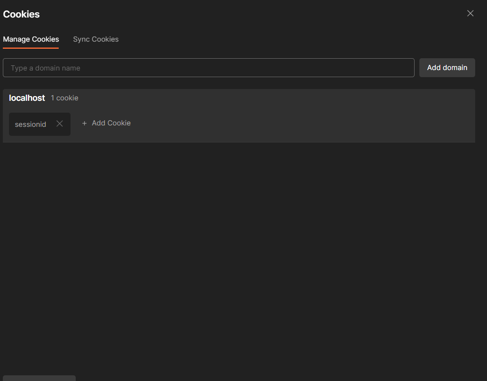

##### 一个巨下头的bug

postman的localhoat和127不是默认相同的，然后就会导致明明登录了却还是没权限

改正后如下：

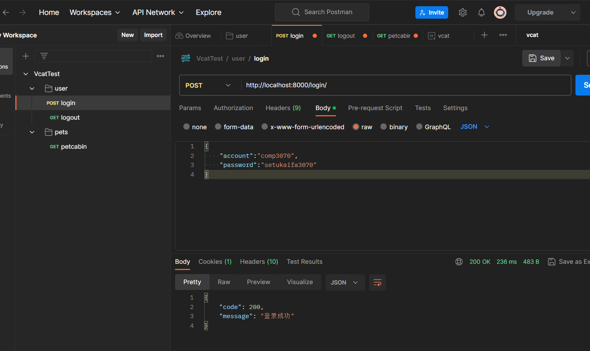

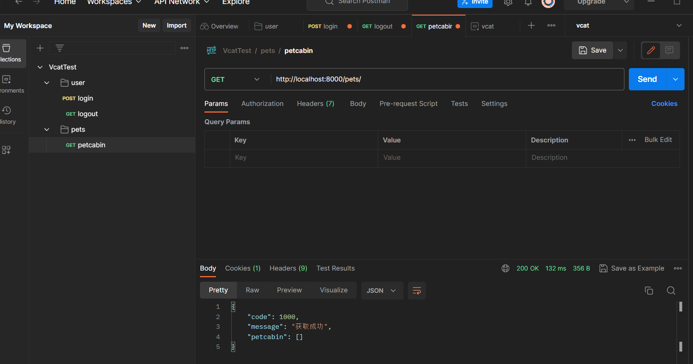

#### (Debug)

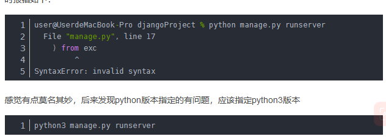


下载sqlite3

https://www.cnblogs.com/xiaoqianbook/articles/14580553.html

https://blog.csdn.net/qq_42685893/article/details/116519140

##### ImageField报错找不到Pillow

https://blog.csdn.net/rusi__/article/details/102958987?spm=1001.2101.3001.6650.2&utm_medium=distribute.pc_relevant.none-task-blog-2%7Edefault%7ECTRLIST%7ERate-2-102958987-blog-98448219.235%5Ev38%5Epc_relevant_default_base3&depth_1-utm_source=distribute.pc_relevant.none-task-blog-2%7Edefault%7ECTRLIST%7ERate-2-102958987-blog-98448219.235%5Ev38%5Epc_relevant_default_base3&utm_relevant_index=1

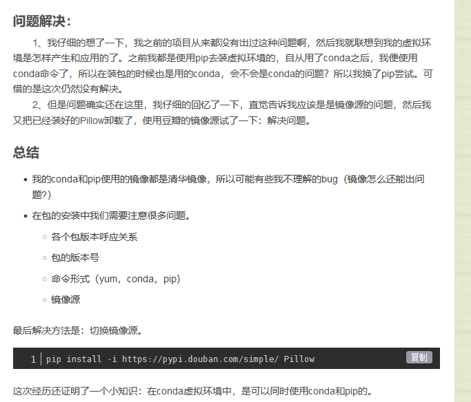

##### 由于在模型类的字段定义中，无法直接引用其他字段作为默认值。

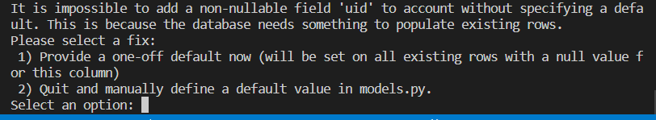

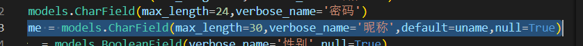

要实现将`nickname`字段的默认值设置为`username`字段的值，可以通过重写`save()`方法来实现。

在`UserInfo`模型类中添加以下代码：

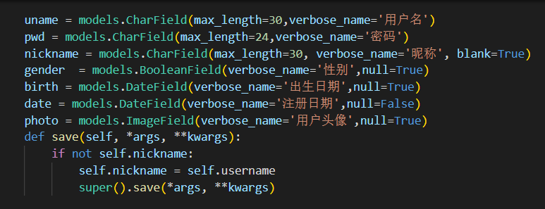

##### migrate提示被删除的表存在

数字开头文件全删


### 4）阿里云RDS MySQL

https://help.aliyun.com/document_detail/607694.html?spm=5176.28008736.J_6443120770.d941683_1.330b3e4dx0H2ga&pipCode=mysql&goodsId=941683&scm=20140722.M_941683._.V_1

使用workbench连接

ctrl+enter步进

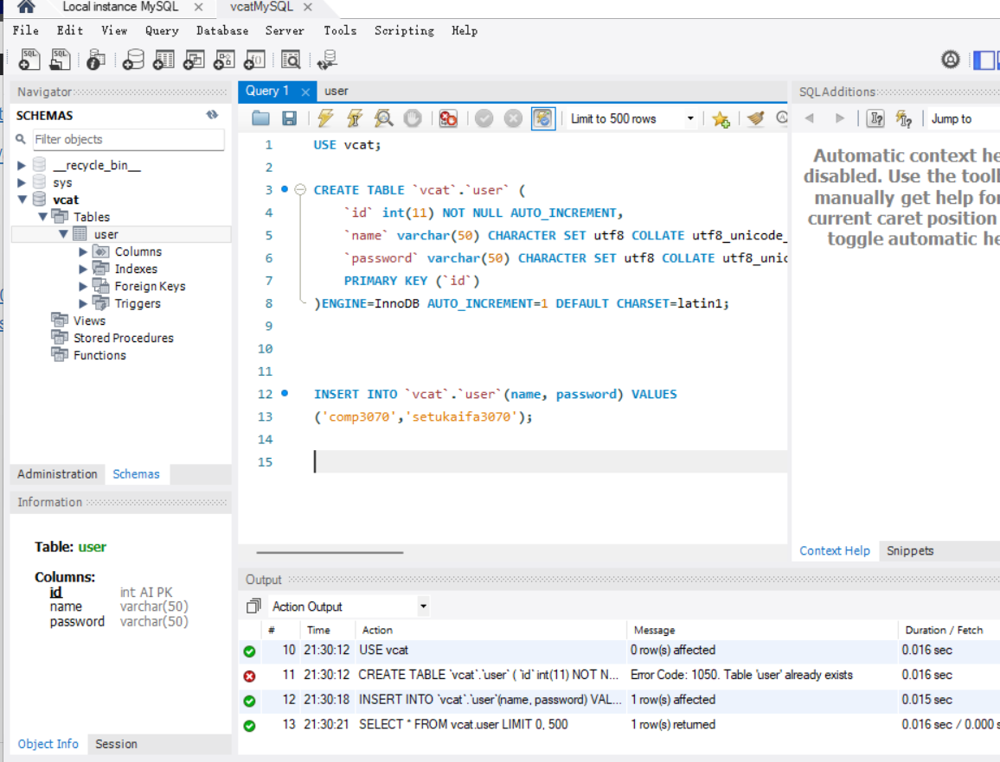

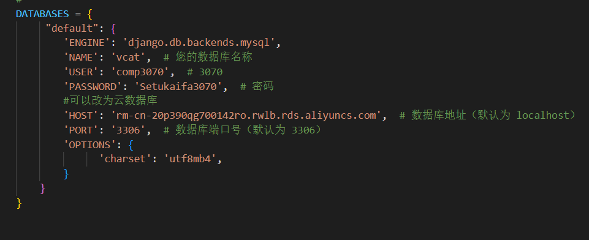

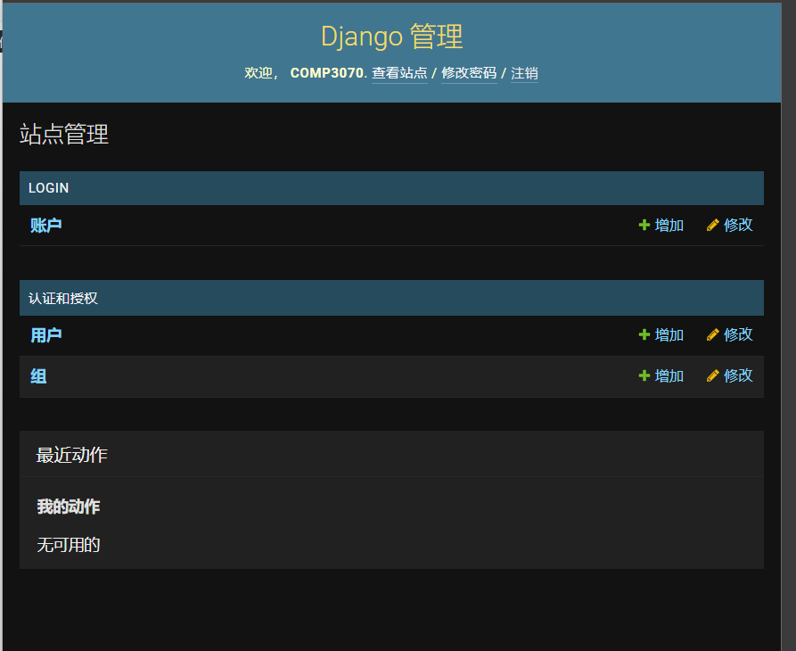

自此数据库上云

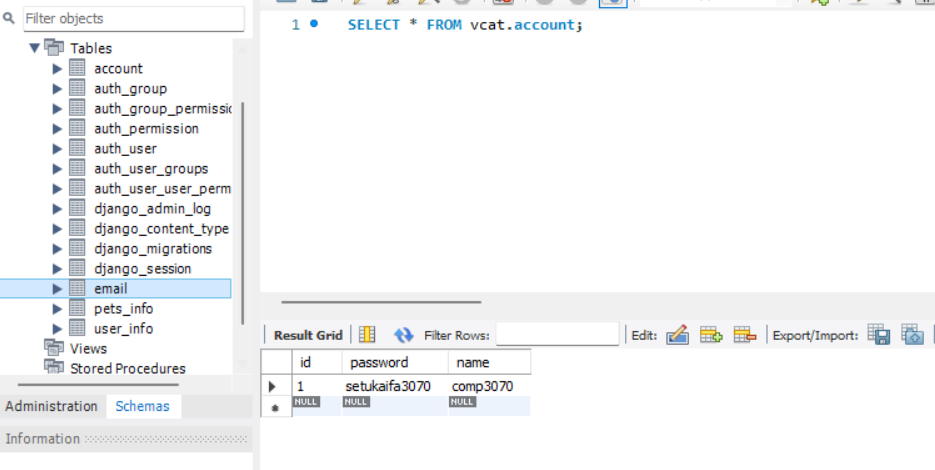

### (5) 游戏本体

#### 引擎

Unity

#### 算法

PettingZoo

#### 图形设计

#### 策划

# 3.书面

### (1) 文献

#### 数据库

#### 论文

#### 其他参考资料

[莱洛三角开发](https://gitee.com/coll45/foc/tree/master)

星露谷开发参考

[稚晖君ElectronBot](https://github.com/peng-zhihui/ElectronBot)

### (2) 策划

#### SRS

#### UML

#### PPT

#### 产品说明书

### (3) 财务计算

