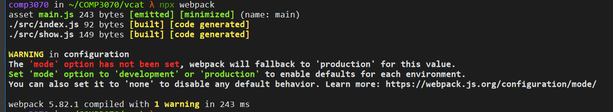
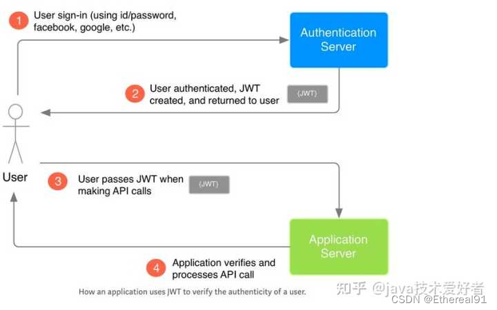
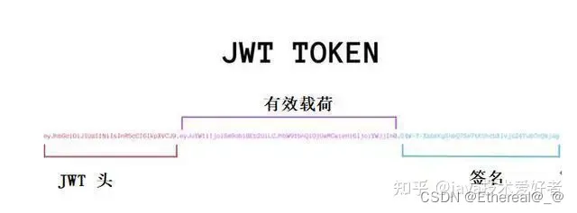

# COMP3070大项目

## 更新日志：

云服务器登录 2.23 xfz

工作内容板块 3.03  xfz

前端开发内容——开发框架、方式等汇总 4.25 xfz 

# -1.工作内容：

### 截至3.6前应完成的任务：

#### （1）软件安装：

​		安装包见qq群文件

1. typora， 用于支持md文件，支持markdown语法，便于撰写开发文档
2. jupyterlab，记得先安装anaconda。jupyterlab是一款内置浏览器的pythonIDE，同时支持markdown语法。

#### （2）测试能否连接云服务器

​			方法参见==2.软件-后端-服务器与网络==

​			workbench先登录自己阿里云账户（可通过任意阿里旗下账号），再登陆linux用户comp3070。若不能直接通过workbench连接则下载xshell进行连接（参考云服务器配置笔记.md）。

### 3.21 剩余工作

(1) UML——zth

(2) 页面设计——Axura


(3) MySQL数据库——登录信息——采集的信息（图像、语言）的存储——zth

​	——python

(4) 微信小程序、vue和react开发——ybs

(5) CV 和 NLP算法——hjc

(6) chatGLM

(7) 图像生成与融合——能接入网页的简单游戏页面——unity


# 0.乱七八糟吹牛逼用

Reality——Game interface: An intellgent  generating and interactable vitural pet 

+ 基于游戏用户互动的数据挖掘系统

+ 基于图像融合的游戏生物自动生成模型

+ 自动环境绘图

+ 生成自然的npc对话

+ 词性评价（非须）

+ 元宇宙——计算机视觉自动建模——数字孪生

  启发：

  元宇宙与现实世界互动的成本高，数字孪生成本高

  游戏内容发展局限于预设内容，自由度有限——新型精灵游戏与图像融合技术

  宠物饲养困难
  
  贾维斯——AI助手

# 1.硬件

### (1) 元件、打板

#### 核心

#### 传感

#### 显示

arduino触摸屏 or 全息

#### 接口

### (2) 焊接

# 2.软件

## (1) Arduino烧录

## (2) 算法

#### CV

#### NLP

#### 强化学习

#### 数据处理算法

## (3) 前端

### 1）开发方法

#### (a) 概览

使用“React技术栈”，即React JS库及其相关框架

本项目采用==React+TypeScript+umi+dva+antd-mobile==的框架开发方式进行搭建。

#### (b) 理由

1.  React：指用于构建用户界面的JavaScript库，具有组件化、声明式等特点，具有优秀的DOM性能优化。

2. React技术栈：其整个技术栈是一个渐进式的框架——主张最少，可以只用其中一部分。例如，开始时只需React， 有新需求后可以引入其他类库如路由库、状态管理库等。

3. TypeScript：TypeScript是JavaScript的超集，最终会被编译为JS代码。它添加了可选的静态类型系统与很多尚未正式发布的ECMAScript新特性，如装饰器。

4. umi：React开发框架。理解为一个专注性能的类next.js前端框架，通过约定、自动生成和解析代码等方式辅助开发。

   - 内置大量性能优化
   - 多端，无缝支持容器和浏览器访问，
   - 类webpack的插件机制
   - 对antd和dva有友好支持

   “文件即路由”——page文件夹下新建文件，umi自动生成与文件路径对应的路由。

   ​	解决如下问题：

   - ​	项目既可以跑在如支付宝/淘宝/微信容器里（多页），又可以跑在普通浏览器里（单页）。
   - 开发调试的启动和热更新时间随项目变大越来越长。
   - 基于路由做按需加载。
   - 支持PWA
   - preact
   - 部署问题

   [umi参考文档](https://www.cnblogs.com/AllenPan/p/16440013.html)

5. 

### 2) 底层模板页与登录页面

#### (a) 模板页面：

1. 带顶部导航条的基础模板（BasicLayout）
2. 权限模板（SecurityLayout）
3. 后续具体增加

#### (b) 基础模板

基础模板作为所有页面的底层模板，会==首先请求用户基本信息==，判断是否登录，如果是进入需要登录的页面并且未登录，则跳转登录页，否则留在当前页面。基础模板需要判断是否需要显示导航条。同时，每个页面刷新都需要判断是否登录，获取用户基础信息也都放在基础模板页，同时记录到user state中。

```react
import {ConnectState,ConnectProps, UserModelState} from '@/models/connect';
interface BasicLayoutProps extends ConnectProps{
    user: UserModelState;
}
```

检测客户端设备对应IP登录状态

（React—>Django(axios->JWT->user)

##### 基本开发

CSS+JS+HTML

vue3, react

[vitejs](https://cn.vitejs.dev/guide/)

[react](https://react.docschina.org/)


##### 响应式网页

ASouthernCat

#### 图像展示

##### 动画制作

blender+verge3D

gooblend

##### AI 动画

Stable diffusion

##### 数据监测展示

Flask 、Dashboard

#### 基本网页框架

##### 基本开发

CSS+JS+HTML

vue3, react

[vitejs](https://cn.vitejs.dev/guide/)

[react](https://react.docschina.org/)

##### 响应式网页

ASouthernCat

#### API

##### 微信小程序接口


### 3) webpack代码打包工具部署

新建目录，在新建目录下执行

```bash
npm init -y
```

初始化项目(生成package.json)


安装webpack-cli(使用webpack的命令行工具）：

```bash
npm install webpack webpack-cli -D
```


运行webpack：

```bash
npx webpack
```

 (要先有src目录和index.html才能成功)


使webpack全局环境下可用：

```bash
npm install webpack -global
```

但全局可能会导致一些版本问题（如项目中webpack被锁定到指定版本）

最新版：

```bash
npm install webpack@beta
```

#### （a) 初始化项目结构

项目结构：

```c
webpack-demo
    |-node_modules
    |-package.json
    |-package-lock.json
   +|-index.html
   +|-/src
   +	|-index.js
   +	|-show.js
```

#### (b) 代码开发

根据个人体验，推荐先使用在线IDE [StackBlitz](https://stackblitz.com/)进行实时渲染开发，然后将代码移植到服务器项目目录中。

git下对应工作目录：[vcat前端](..\软件开发\前端\vcat)




index.js文件被打包到了dist文件夹下，默认使用production mode（生产环境）。打开dist/main.js可以看到被压缩的代码，说明是生产环境打包。

执行构建后的项目结构：

```bash
webpack-demo
   +|-dist
   +	|-main.js
    |-node_modules
    |-package.json
    |-package-lock.json
    |-index.html
    |-/src
    	|-index.js
    	|-show.js
```

总的来说，执行npx webpack会将脚本src/index.js作为入口起点，也会生成dist/main.js作为输出。目录下多出dist目录，里面的main.js文件是一个可执行的JS文件，包含webpackBootstrap启动函数。

然后将index.html的js文件引用替换为dist/main.js

### 4)nginx配置

查看 Nginx 配置文件的位置：

```bash
nginx -t
```


## (4) 后端

### 1）框架

使用Django框架，系统采用前后端分离设计，后端Django采用Django RestFramework，为前端界面提供数据及其他资源。页面端为微信小程序的开发提供API预置接口。

#### (a) Django Rest framework —— JWT实现登录

JWT （Json Web Token) 主要用于用户登录鉴权，一种认证机制，让后台知道该请求是来自于受信的客户端。



1. 用户使用账号、密码登录应用，登录的请求发送到 Authentication Server。
2. Authentication Server 进行用户验证，然后创建 JWT 字符串返回给客户端。
3. 客户端请求接口时，在请求头带上 JWT。
4. Application Server 验证 JWT 合法性，如果合法则继续调用应用接口返回结果。

```reStructuredText
xxxxx.yyyyy.zzzzz
```



##### Header

JWT 第一部分是头部分，它是一个描述 JWT 元数据的 Json 对象，通常如下所示。

```json
{
    "alg": "HS256",
    "typ": "JWT"
}
```

alg 属性表示签名使用的算法，默认为 HMAC SHA256（写为HS256），typ 属性表示令牌的类型，JWT 令牌统一写为JWT。

最后，使用 Base64 URL 算法将上述 JSON 对象转换为字符串保存。

##### Payload

JWT 第二部分是 Payload，也是一个 Json 对象，除了包含需要传递的数据，还有七个默认的字段供选择。

- iss (issuer)：签发人/发行人
- sub (subject)：主题
- aud (audience)：用户
- exp (expiration time)：过期时间
- nbf (Not Before)：生效时间，在此之前是无效的
- iat (Issued At)：签发时间
- jti (JWT ID)：用于标识该 JWT

```json
{
    //默认字段
    "sub":"主题123",
    //自定义字段
    "name":"java技术爱好者",
    "isAdmin":"true",
    "loginTime":"2021-12-05 12:00:03"
}
```

需要注意的是，默认情况下 JWT 是未加密的，任何人都可以解读其内容，因此一些敏感信息不要存放于此，以防信息泄露。

JSON 对象也使用 Base64 URL 算法转换为字符串后保存，是可以反向反编码回原样的，这也是为什么不要在 JWT 中放敏感数据的原因。


##### Signature

```text
header (base64URL 加密后的)

payload (base64URL 加密后的)

secret
```

JWT 第三部分是签名。是这样生成的，首先需要指定一个 secret，该 secret  仅仅保存在服务器中，保证不能让其他用户知道。这个部分需要 base64URL 加密后的 header 和 base64URL 加密后的  payload 使用 . 连接组成的字符串，然后通过header 中声明的加密算法 进行加盐secret组合加密，然后就得出一个签名哈希，也就是Signature，且无法反向解密。

那么 Application Server 如何进行验证呢？可以利用 JWT 前两段，用同一套哈希算法和同一个 secret 计算一个签名值，然后把计算出来的签名值和收到的 JWT 第三段比较，如果相同则认证通过。

```react
loginHandler(){
	this.$axios.post(`${this.$settings.HOST}/user/login/`, {
	  username: this.username,
	  password: this.password
	}).then(response=>{
	  if(this.remember){
	    //记住登录状态
	    sessionStorage.removeItem("user_token")
	    localStorage.user_token = response.token
	  }else{
	    //不记住登录状态
	    localStorage.removeItem("user_token")
	    sessionStorage.user_token = response.token
	  }
	}).catch(error=>{
	  this.$message.error("登录失败")
	  console.log(error.response)
	})
}

```

[JWT参考文档1(定义、与Django的user)](https://blog.csdn.net/weixin_45410366/article/details/125031959)

#### (b) axios 实现前后端通信

##### pre: ajax

**AJAX（ Asynchronous JavaScript and XML）**指异步和JavaScript和XML结合的一种技术。ajax可以实现网页的异步更新，意味着可以不重新加载整个页面的情况下，对网页的某个部分进行更新。组成：

1. 异步的js事件
2. 其他的js（用来处理解析数数据）
3. XMLHttpRequest对象
4. 数据（txt、json、xml、html）

请求原理

1. 创建XMLHttpRequest实例对象；
2. 设置回调函数；
3. 通过XMLHttpRequest.open发出Http网络请求,和服务器端进行连接；
4. 服务器端收到请求，发出请求的数据；
5. 检查网络请求对象的状态，如果响应成功，浏览器接收返回的数据，并且更新页面。

##### Axios

axios是通过Promise对ajax的封装，是一个基于Promise 的Http库，可以在浏览器和Node.js中使用。

简单理解为：axios是一个封装好的，基于Promise的发送请求的方法，不用设置回调，直接调用then方法。

1. 在浏览器中创建XMLHttpRequest对象；
2. 在node.js中创建Http请求
3. 支持拦截请求和响应
4. 自动转换将响应为JSON格式
5. 提供一些并发请求

##### Why axios

1. axios是通过Promise实现ajax技术的一种封装，就像jquery对ajax的封装一样；
2. axios返回的数据是一个promise，ajax返回的数据是回调；
3. axios比ajax更加好用，更加安全；

[axios参考文档（定义、基本使用）](https://blog.csdn.net/Senora/article/details/122220983)

[axios实现登录操作react与Django前后端交互](https://backend.devrank.cn/traffic-information/7081681144735107109)

### 2)协议


#### 数据库

mysql + json + ....

#### 服务器与网络

##### 服务器

服务器：阿里云[ecs-workbench](https://ecs-workbench.aliyun.com/?from=EcsConsole&instanceType=ecs&regionId=cn-shenzhen&instanceId=i-wz9d1gubaizfxmkfak9t&resourceGroupId=&language=zh)

先登录个人阿里云用户再用Linux用户登录服务器：

如果workbench无法登录则下载xshell登录

用户名：comp3070

密码: setukaifa3070

公网ip:120.25.2.21

域名：

apache2 + .....

###### zsh

实例名：


CrayCatXFZ211019

i-wz9d1gubaizfxmkfak9t

#### 核心开发语言

C/py/java

#### 

### (5) 游戏本体

#### 引擎

Unity

#### 算法

PettingZoo

#### 图形设计

#### 策划

# 3.书面

### (1) 文献

#### 数据库

#### 论文

#### 其他参考资料

[莱洛三角开发](https://gitee.com/coll45/foc/tree/master)

星露谷开发参考

[稚晖君ElectronBot](https://github.com/peng-zhihui/ElectronBot)

### (2) 策划

#### SRS

#### UML

#### PPT

#### 产品说明书

### (3) 财务计算

