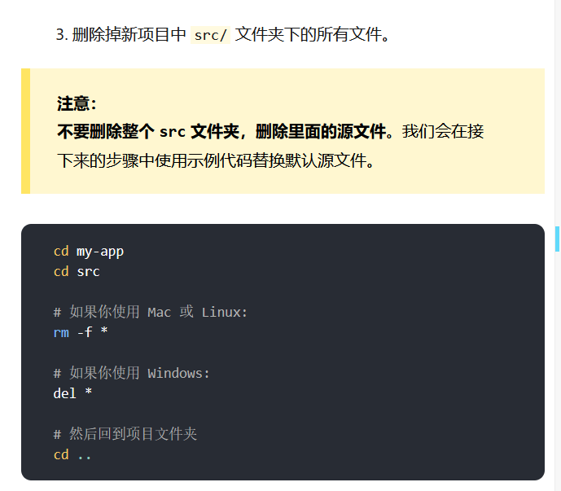
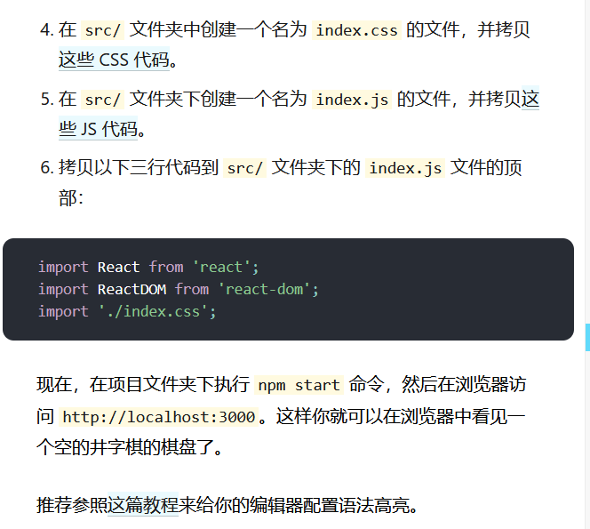
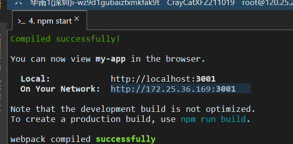
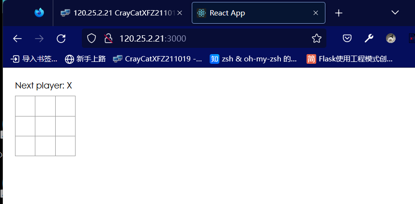

# React

[官方文档](https://react.docschina.org/docs/hello-world.html)

React 是一个 JavaScript 库

使用 React 可以将一些简短、独立的代码片段组合成复杂的 UI 界面，这些代码片段被称作“组件”。

# ES6

ECMAScript6

[JS教程](https://developer.mozilla.org/zh-CN/docs/Web/JavaScript/Language_Overview)

# Create-my-react

Create React App 不会处理后端逻辑或操纵数据库；它只是创建一个前端构建流水线（build pipeline），所以你可以使用它来配合任何你想使用的后端。它在内部使用 [Babel](https://babeljs.io/) 和 [webpack](https://webpack.js.org/)，但你无需了解它们的任何细节。

当你准备好部署到生产环境时，执行 `npm run build` 会在 `build` 文件夹内生成你应用的优化版本。你能[从它的 README](https://github.com/facebookincubator/create-react-app#create-react-app--) 和[用户指南](https://facebook.github.io/create-react-app/)了解 Create React App 的更多信息。

```bash
npx create-react-app my-app --template typescript
```





```css
body {
  font: 14px "Century Gothic", Futura, sans-serif;
  margin: 20px;
}

ol, ul {
  padding-left: 30px;
}

.board-row:after {
  clear: both;
  content: "";
  display: table;
}

.status {
  margin-bottom: 10px;
}

.square {
  background: #fff;
  border: 1px solid #999;
  float: left;
  font-size: 24px;
  font-weight: bold;
  line-height: 34px;
  height: 34px;
  margin-right: -1px;
  margin-top: -1px;
  padding: 0;
  text-align: center;
  width: 34px;
}

.square:focus {
  outline: none;
}

.kbd-navigation .square:focus {
  background: #ddd;
}

.game {
  display: flex;
  flex-direction: row;
}

.game-info {
  margin-left: 20px;
}

```

```js
class Square extends React.Component {
  render() {
    return (
      <button className="square">
        {/* TODO */}
      </button>
    );
  }
}

class Board extends React.Component {
  renderSquare(i) {
    return <Square />;
  }

  render() {
    const status = 'Next player: X';

    return (
      <div>
        <div className="status">{status}</div>
        <div className="board-row">
          {this.renderSquare(0)}
          {this.renderSquare(1)}
          {this.renderSquare(2)}
        </div>
        <div className="board-row">
          {this.renderSquare(3)}
          {this.renderSquare(4)}
          {this.renderSquare(5)}
        </div>
        <div className="board-row">
          {this.renderSquare(6)}
          {this.renderSquare(7)}
          {this.renderSquare(8)}
        </div>
      </div>
    );
  }
}

class Game extends React.Component {
  render() {
    return (
      <div className="game">
        <div className="game-board">
          <Board />
        </div>
        <div className="game-info">
          <div>{/* status */}</div>
          <ol>{/* TODO */}</ol>
        </div>
      </div>
    );
  }
}

// ========================================

const root = ReactDOM.createRoot(document.getElementById("root"));
root.render(<Game />);

```



记得服务器安全组开放端口3000、3001

安装代理备用：Nginx、apache



# 组件类

一个组件接收一些参数：props

通过render方法返回屏幕内容的描述（React元素）

### JSX语法：

#### 嵌入表达式

JSX，是一个 JavaScript 的语法扩展。

在 JSX 语法中，可以在大括号内放置任何有效的 [JavaScript 表达式](https://developer.mozilla.org/en-US/docs/Web/JavaScript/Guide/Expressions_and_Operators#Expressions)。

##### Ex1:

```jsx
const name = 'Josh Perez';
const element = <h1>Hello, {name}</h1>;

ReactDOM.render(
	element,
    document.getElementById('root');
);
```

##### Ex2:

调用 JavaScript 函数 `formatName(user)` 的结果，并将结果嵌入到 `<h1>` 元素中：

```jsx
function formatName(user) {
    return user.firstName+' '+user.lastname;
}
const user = {
    firstName: 'Harper',
    lastName: 'Perez'
};
const element=(
	<h1>
        Hello, {formatName(user)}!
    </h1>
);

ReactDOM.render(
	element;
    document.getElementById('root')
);
```


#### JSX作为表达式

可以在 `if` 语句和 `for` 循环的代码块中使用 JSX，将 JSX 赋值给变量，把 JSX 当作参数传入，以及从函数中返回 JSX：

##### Ex3:

```jsx
function getGreeting(user){
    if(user){
        return <h1>Hello, {formatName(user)}!</h1>;
    }
    return <h1>Hello, Stranger.</h1>
}
```

#### JSX 指定属性

使用引号，来将属性值指定为 字符串字面量：

##### Ex4：

```jsx
const element = <a href="https://www.reactjs.org"> link</a>;
```

使用大括号，来在属性值中插入一个 JavaScript 表达式：

##### Ex5:

```jsx
const element = </img>;
```

引号和大括号不能同时使用

#### JSX 指定子元素

##### Ex6：

无内容闭合标签：

```jsx
const element = ;
```

JSX 标签里能够包含很多子元素:

```jsx
const element = (
	<div>
        <h1>Hello!</h1>
        <h2>Good to see you here.</h2>
    </div>
);
```

#### JSX防注入攻击

 安全地在JSX 当中插入用户输入内容：

```jsx
const title = response.potentiallyMaliciousInput;
// 直接使用是安全的：
const element = <h1>{title}</h1>;
```

React DOM 在渲染所有输入内容之前，默认会进行[转义](https://stackoverflow.com/questions/7381974/which-characters-need-to-be-escaped-on-html)。它可以确保在你的应用中，永远不会注入那些并非自己明确编写的内容。所有的内容在渲染之前都被转换成了字符串。这样可以有效地防止 [XSS（cross-site-scripting, 跨站脚本）](https://en.wikipedia.org/wiki/Cross-site_scripting)攻击。

#### JSX表示对象

Babel 会把 JSX 转译成一个名为 `React.createElement()` 函数调用。

以下两种示例代码完全等效：

```jsx
const element = (
  <h1 className="greeting">
    Hello, world!
  </h1>
);
```

```jsx
const element = React.createElement(
  'h1',
  {className: 'greeting'},
  'Hello, world!'
);
```

`React.createElement()` 会预先执行一些检查，以帮助你编写无错代码，但实际上它创建了一个这样的对象：

```jsx
// 注意：这是简化过的结构
const element = {
  type: 'h1',
  props: {
    className: 'greeting',
    children: 'Hello, world!'
  }
};
```

这些对象被称为 “React 元素”。它们描述了你希望在屏幕上看到的内容。React 通过读取这些对象，然后使用它们来构建 DOM 以及保持随时更新。

### 元素渲染

元素是构成 React 应用的最小砖块。

元素描述了你在屏幕上想看到的内容。

```jsx
const element = <h1>Hello, world</h1>;
```

与浏览器的 DOM 元素不同，React 元素是创建开销极小的普通对象。React DOM 会负责更新 DOM 来与 React 元素保持一致。

#### 将一个元素渲染为 DOM

根DOM节点：

HTML 文件某处有一个 `<div>`

```jsx
<div id="root"></div>
```

该节点内所有内容都由React DOM管理。

将React元素渲染到根DOM节点->一起传入[`ReactDOM.render()`](https://react.docschina.org/docs/react-dom.html#render)：

```jsx
const element = <h1>Hello, world</h1>;
ReactDOM.render(element, document.getElementById('root'));
```

元素不可变——特定时刻的UI，更新方式是传入全新元素

##### Ex7 计时器

```jsx
function tick(){
    const element = (
    	<div>
            <h1>Hello, world!</h1>
        	<h2>It is {new Date().toLocaleTimeString()}.</h2>
        </div>
    );
    ReactDOM.render(element, document.getElementById('root'));
}
setInterval(tick,1000);
```

这个例子会在 [`setInterval()`](https://developer.mozilla.org/en-US/docs/Web/API/WindowTimers/setInterval) 回调函数，每秒都调用 [`ReactDOM.render()`](https://react.docschina.org/docs/react-dom.html#render)。

大多数 React 应用只会调用一次 [`ReactDOM.render()`](https://react.docschina.org/docs/react-dom.html#render)

React 只更新它需要更新的部分

```html
<div />
```


会被编译成

```jsx
React.createElement('div')
```

EX:

```html
class ShoppingList extends React.Component {
  render() {
    return (
      <div className="shopping-list">
        <h1>Shopping List for {this.props.name}</h1>
        <ul>
          <li>Instagram</li>
          <li>WhatsApp</li>
          <li>Oculus</li>
        </ul>
      </div>
    );
  }
}

// 用法示例: <ShoppingList name="Mark" />
```

->

```jsx
return React.createElement('div', {className: 'shopping-list'},
  React.createElement('h1', /* ... h1 children ... */),
  React.createElement('ul', /* ... ul children ... */)
);
```

在 JSX 中可以任意使用 JavaScript 表达式，只需要用一个大括号把表达式括起来。

每一个 React 元素事实上都是一个 JavaScript 对象，可以把它当作保存在变量中或者作为参数传递。

### 通过Props传递数据

传递一个名为value的prop到Square中：

```js
class Board extends React.Component{
  renderSquare(i){
    return <Square value={i} />
  }
}
```

{this.props.value} 显示传入的值

```js
class Square extends React.Component{
  render(){
    return (
      <button className="square">
        {this.props.value}
      </button>
    )
  }
}
```

# umi框架


